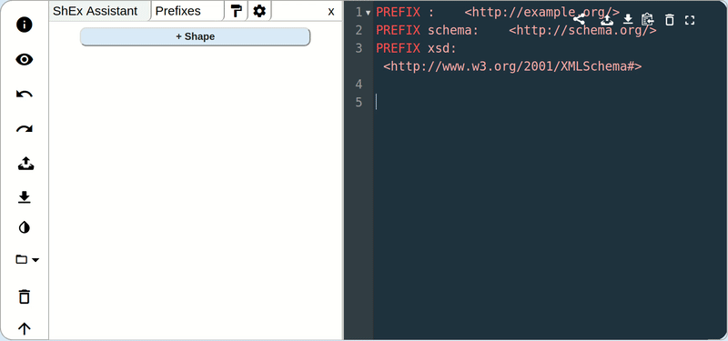

# ShExAuthor
ShExAuthor is a  [Shape Expressions (ShEx)](http://shex.io/) graphic assistant where users can create their Shapes in a much more visual way.
In combination with [YASHE](https://github.com/weso/YASHE) editor, ShExAuthor allows you to use the editor and the assistant at the same time.

  

Create a Shape using the assistant

  

Create a Shape using the assistant

